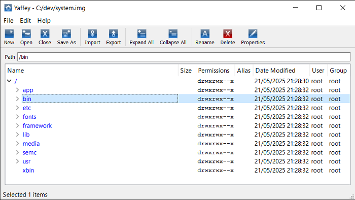

# Yaffey

A GUI utility for reading, editing and creating YAFFS2 images. Read Android system and data partitions and modify them how you like. Import and export files to and from the images.

Originally released on [Google Code](http://code.google.com/p/yaffey) and posted on [XDA Forums](https://xdaforums.com/t/tool-yaffey-utility-for-reading-editing-and-writing-yaffs2-images.1645412) in 2012.

Built for Qt 4.8.1. Updated to build with Qt 5.8.0 in 2017.

***This tool is out of date now that Android no longer uses YAFFS2, in favour of EXT4.***

## Features
- Create new YAFFS2 image
- Open existing image
- Export files/directories from image
- Import files into image (permissions inherited from parent directory, dates created/modified/accessed set to current date & time)
- Delete files
- Edit filenames
- Edit permissions
- Edit user and group ids
- Edit symbolic link aliases
- ECC (Error Checking & Correction) support
